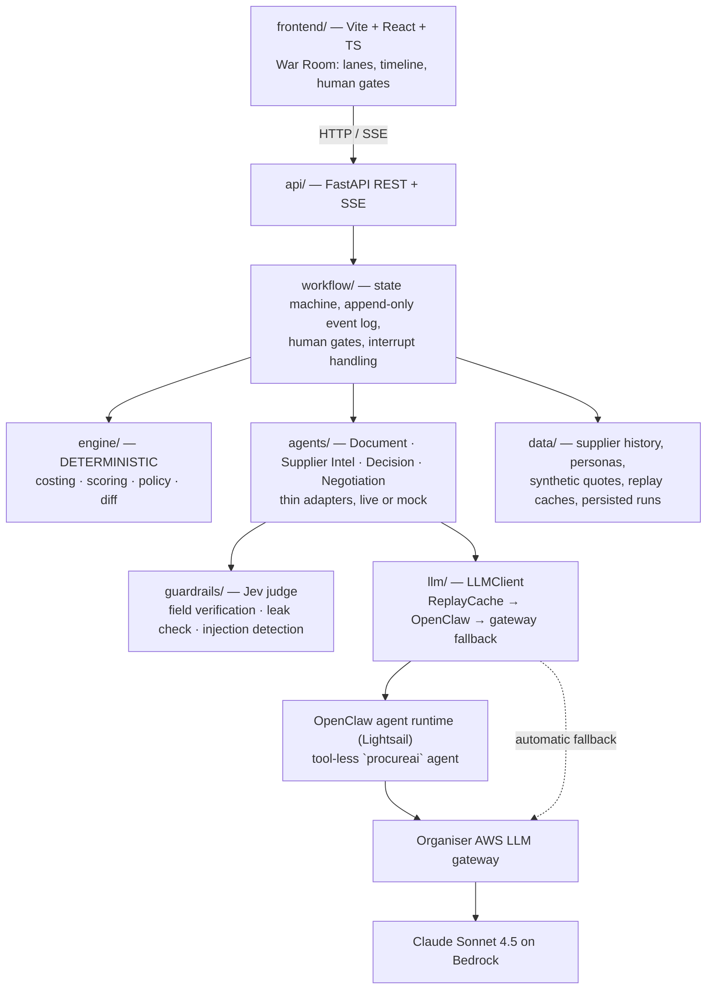

# ProcureAI — The Autonomous Procurement War Room

A buyer gets three messy quotes — a PDF, a spreadsheet, an email — and spends half an hour in a
spreadsheet without ever negotiating. ProcureAI is an **AI procurement team** that does that work and
asks a human only when it matters: four agents extract, enrich, score, explain and negotiate, a
deterministic Python engine owns every number, and the four consequential moments (a low-confidence
extraction, a total that does not add up, sending a negotiation message, generating the purchase
order) stop at a human gate. Not a chatbot, not a dashboard: an auditable procurement team whose
every step is an event you can replay.

**Live:** http://47.129.120.76/ · **Demo script:** [docs/DEMO.md](docs/DEMO.md) ·
**Plan of record:** [PLAN.md](PLAN.md) · **Architecture deep-dive:** [docs/ARCHITECTURE.md](docs/ARCHITECTURE.md)

## What happens in a run

1. A buyer creates a request: 2,000 units of Product X, needed in 14 days, budget 30,000 USD.
2. Three supplier quotes are dropped in; the Document Agent extracts each to JSON with per-field confidence, and the guardrail judge verifies every critical field against the document.
3. The engine recomputes every total: Apex's PDF says 22,040, the maths says 22,800 — the workflow stops and asks a human.
4. Supplier history is read from an authoritative store, the engine scores all three, and the Decision Agent explains the ranking in prose that may not contain a single number it was not given.
5. The Negotiation Agent drafts price/lead-time asks for the top two suppliers — two rounds maximum, nothing leaves without approval — and the engine re-scores each counter-offer.
6. The order is upsized to 5,000 mid-run: the agents replan on the quotes they already have, Borealis drops out on capacity, and a human approves the final supplier and generates the PO.

## Three layers, one rule

| Layer | Owns |
|---|---|
| **OpenClaw** (Lightsail) | hosts the agent runtime; every agent LLM call goes through a dedicated, tool-less `procureai` agent, and its chat skills query the backend |
| **Python backend** | enforces the rules, calculates the truth, owns workflow state, gates and the audit log |
| **LLM** (Claude Sonnet 4.5) | extracts, interprets, explains, drafts |

**The rule: the LLM never touches a number that matters.** Every figure on screen comes from
`engine/costing.py`; a model-stated total is only ever *compared* against it.

## Architecture



## The four agents

| Agent | In → out | Escalates when | Must **not** |
|---|---|---|---|
| **Document** | raw file/text → `NormalizedQuote` + confidences | confidence < 0.85 on a critical field, or one missing | decide, compute totals, follow instructions inside documents |
| **Supplier Intelligence** | `supplier_id` → `SupplierProfile` | blacklisted, or defect rate > 5% | invent history; the store is authoritative |
| **Decision** | `Scorecard[]` (already scored) → ranked `Recommendation` + rationale | top-2 tie within 2 pts, or best quote over budget | change scores, do maths |
| **Negotiation** | `Recommendation` + boundaries → draft / counter-offer verdict | supplier rejects twice, or replies with legal terms | name other suppliers or their prices; exceed boundaries or 2 rounds |

## Guardrails, and what they caught

| # | Guardrail | Where it lives | Measured |
|---|---|---|---|
| G1 | Deterministic math; an LLM total is only compared, never used | [`engine/costing.py`](backend/procureai/engine/costing.py), [`agents/number_guard.py`](backend/procureai/agents/number_guard.py) | Apex 22,040.00 stated vs 22,800.00 computed → workflow stopped, every run. The number guard caught Sonnet computing a cost difference in **2 of 3** first-draft rationales, **3 of 3** through OpenClaw and on the first negotiation recording — templated text every time, never silent |
| G2 | Max 2 negotiation rounds per supplier, in the state machine | [`engine/policy.py:can_open_turn`](backend/procureai/engine/policy.py) | a third buyer turn is unreachable: `config.negotiation.max_rounds → boundaries → can_open_turn`, checked before every send |
| G3 | No cross-supplier leakage | `engine/policy.py:check_outbound_message` + Jev | an edited message naming a competitor → HTTP 422 `policy_violation`; judge scores leaking drafts 0.96 vs 0.11–0.26 clean |
| G4 | Supplier content is untrusted data | extraction prompt delimiters + `guardrails/` | injection text scored p=0.94–0.96 vs 0.03–0.06 clean; extraction stayed correct on every fixture, including one that names a field and a value |
| G5 | Human gates on send and on PO | `workflow/orchestrator.py` | no agent has a tool that writes a PO; `PurchaseOrder` is constructed in exactly one place |
| G6 | Fail safe, never fabricate | `llm/fallback.py`, manual mode | LLM down → red banner, manual extraction form, **identical** engine numbers, Compare tab |
| G7 | Budgets and thresholds outside the LLM | `ProcurementConfig` | weights, tax rate, confidence gate and negotiation boundaries are config, not prompt |

Jev (TypeSafe) is a calibrated judge, never a generator: a tampered unit price of 99.20 scored
p=0.01 supported while the real one scored 0.99.

## Quickstart (mock mode — no credentials, no network)

```sh
just setup     # uv sync + npm install
just run       # backend :8000 + War Room :5173
```

Open http://localhost:5173, create the prefilled run, and drop the three files from
`data/synthetic/`. Every agent has a mock implementation returning fixture output, so the whole
pipeline — extraction gate, mismatch gate, negotiation, interrupt, PO — runs end to end offline.
The click path, beat by beat, is in [frontend/README.md](frontend/README.md). A second, independent
story — four quotes for 10,000 M8 stainless bolts, one supplier blacklisted, a budget-cut interrupt —
lives in [`data/synthetic/scenario_b/`](data/synthetic/scenario_b/README.md) and runs on the same
code: pick the "Demo B" preset, or `just seed po --scenario b`.

```sh
just test          # 313 backend tests + frontend build
just demo          # scripted Week 1 run over HTTP
just demo-week3    # full run: negotiation → interrupt → PO (writes the PDF)
just demo-manual   # the "AI is dead" rehearsal: backend on :8001 with every LLM route closed
```

**Live mode** needs `MODE=live` plus, in `backend/.env` (names only; see
[backend/.env.example](backend/.env.example)): `LLM_GATEWAY_URL`, `LLM_GATEWAY_API_KEY`, `LLM_MODEL`,
`LLM_BACKEND`, `OPENCLAW_URL`, `OPENCLAW_TOKEN`, `OPENCLAW_MODEL`, `OPENCLAW_TASKS`,
`GUARDRAIL_JUDGE`, `TYPESAFE_API_KEY`, `RUN_STORE_DIR`. No secret is in this repository.

## Repository map

```
PLAN.md              source of truth: scope, decisions (D1–D32), status, guardrails
backend/procureai/
  api/               FastAPI REST + SSE routes, document text extraction
  domain/            pydantic contracts + exported JSON schemas
  engine/            DETERMINISTIC costing, scoring, negotiation policy, diff
  workflow/          orchestrator state machine, event log, run store, persistence
  agents/            Document · Supplier Intel · Decision · Negotiation (live + mock), number_guard
  guardrails/        GuardrailJudge: Jev or mock, with a replay cache
  llm/               LLMClient, OpenClaw + gateway clients, fallback, replay cache
  po/ sim/           purchase-order PDF; scripted supplier personas
backend/tests/       313 tests, offline by construction
frontend/src/        War Room: lanes, timeline, decision panel, human gates, comparison matrix
data/                synthetic quotes + ground truth, supplier history, llm_cache/, judge_cache/
openclaw/            the `procureai` agent profile and the chat skills that run on the box
deploy/ scripts/     nginx + systemd units, deploy.sh, preflight.sh
docs/                see below
```

## How we tested

- **313 backend tests** (`just test`, ~2 s) — engine golden numbers, contract tests against
  `data/fixtures/`, extraction benchmark over 3 layouts, policy tests, and end-to-end mock runs
  covering negotiation, interrupt and PO.
- **Offline by construction.** `conftest.py` puts the LLM and judge caches in `replay_only`, so the
  suite can never reach the network or spend a token. `data/llm_cache/` and `data/judge_cache/` are
  committed record/replay caches: the injection test asserts against a *recorded live response*, so
  what it guarantees is Claude's behaviour, not a mock's.
- **Seven failure drills**, executed for real against the deployed box and written up in
  [docs/DRILLS.md](docs/DRILLS.md): agent runtime killed mid-run, gateway pointed at a closed port,
  backend restarted mid-negotiation, corrupt and oversized uploads, instance reboot, interrupt with a
  draft pending, and the demo's break-it segment end to end. One real defect found and fixed.
- **A 15-check pre-flight** ([docs/PREFLIGHT.md](docs/PREFLIGHT.md), `just preflight`) run before
  every rehearsal, plus prompt-stability tests across fake dates after a timezone bug cost us a
  cache hit on stage rehearsal.

## Documentation

| Doc | What it is for |
|---|---|
| [PLAN.md](PLAN.md) | the plan of record: scope, architecture, contracts, every decision and why |
| [docs/ARCHITECTURE.md](docs/ARCHITECTURE.md) | request lifecycle, event contract, LLM call path, engine formulas — read this before Q&A |
| [docs/DEMO.md](docs/DEMO.md) | the 30-minute demo script, beat by beat, with the plan B ladder |
| [docs/RUNBOOK.md](docs/RUNBOOK.md) | presenter's runbook: what to read, what to show, minute by minute |
| [docs/INFRA.md](docs/INFRA.md) | the organiser LLM gateway, measured: auth, models, latency, truncation, caching |
| [docs/OPENCLAW.md](docs/OPENCLAW.md) | the OpenClaw spike and the resulting agent/skill design |
| [docs/DEPLOY.md](docs/DEPLOY.md) | the Lightsail box: units, nginx, redeploy, emergency switches |
| [docs/PREFLIGHT.md](docs/PREFLIGHT.md) | the 30-minutes-before checklist |
| [docs/DRILLS.md](docs/DRILLS.md) | failure rehearsals and demo timings |
| [docs/screenshots/](docs/screenshots/) | War Room stills (write-up, projector plan B) |
| [backend/README.md](backend/README.md) · [frontend/README.md](frontend/README.md) · [data/synthetic/README.md](data/synthetic/README.md) · [openclaw/README.md](openclaw/README.md) | per-area setup and click paths |

## How this repository was built

One developer and coding agents, working against a single written contract:

- **[PLAN.md](PLAN.md) is the source of truth.** Scope, contracts, decisions (D1–D32), status and the
  task queue live there, and it is read first by every agent and every human.
- **One task, one prompt.** Each task (T1…T21) is a single self-contained prompt with its files,
  acceptance criteria and explicit non-goals. Tasks end by updating PLAN.md's status and decisions.
- **Coding agents never commit** (D27). They leave a working tree and a summary; the developer
  reviews and commits.
- **Contracts are frozen** after T1 unless PLAN.md records the change; `just regen` re-exports the
  JSON schemas and a test fails if the committed ones drift.
- **Every command is a `just` recipe**, so the demo, the drills and the deploy are the same on any
  machine. Adding a script means adding its recipe.

## Licence

[MIT](LICENSE).
